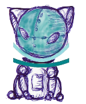

# (Nombre del proyecto)  

(Plantilla para la creación de un proyecto Multimedia Interactivo)

Proyecto de [Creación Multimedia y Periodismo Multiplataforma](https://github.com/mgea/PeriodismoMultimedia)  
[Master de Nuevos medios interactivos y periodismo multimedia](https://masteres.ugr.es/newmedia-periodismo-multimedia/)  
Facultad de Comunicación y Documentación  
Univesidad de Granada  

----

**Titulo** : _______

**Autor(es)** ______________

**Resumen** : _________

**logotipo** :  ________

**Slogan** (frase motivadora/inspiradora): ________

**Hashtag**  ___

**Licencia**    (usar una creative commons: revisar en https://creativecommons.org/licenses/?lang=es_ES) 

**Fecha** : 2024

**Medios** (donde se tiene presencia): 

* :octocat: (github url) 
* ArcWeave:
* Protopie:
*  

--- 

### Metodología

Metodología de desarrollo: Diseño de contenidos digitales mediante estrategia de diseño de Experiencias de usuario (UX experiences) 

### Etapa 1: Ideación de proyecto 

**Investigación de campo**   Desk research propuestas inspiradoras para el proyecto) 

* @LadyDistopia (link) ...¿ por qué ?
* (...)
* 

**Necesidad/oportunidad** 

**Motivación de la propuesta** .... ¿ por qué consideras interesante ? 

**Personas/Usuarios**  (...¿en quién piensas que puede ser útil ? ¿cual es tu publico objetivo?) 

**Estilo de narración**  (...indica como se hace uso de los medios)  

(ejemplos/alternativas) 
* documental interactivo 
* videojuego 
* ... 

* Inspiración (moodboard, imagen) - usando miro/milanote o https://excalidraw.com/

### Etapa 2: Prototipar / productos 

(Productos que has desarrollado y como se plantea la integración de los diferentes medios, pon los que uses) 

* Imagen visual (Portada / Diseño de Interfaz) y herramienta usada 

* redes sociales (...) 

* publicidad: banner (... ) 

* ...

### Etapa 3: Técnicas de evaluación utilizadas

(Estrategia que plantearías para evaluar tu propuesta, medidodes e indicadores de éxito, elige / propone) 

* Test con usuarios (...) 
* ... 

### Conclusiones y trabajo futuro

* Grado de consecución del proyecto 
* Problemas identificados  (técnicos / sobre la idea inicial / planificacion… ) 
* Propuestas de mejora (por qué consideras que merece la pena continuar)
* Posible interés del proyecto (¿ Quien podría  colaborar / involucrarse en el proyecto? ¿viable?)

Referencias y recursos: 

* Artículos ..  
* Productos utilizados  
* Propuestas de me

(...)

----

**Referencias y recursos utilizados** :

* [Proceso UX](https://uxmastery.com/resources/process/)
* [Diseño de Experiencias UX](http://www.nosolousabilidad.com/articulos/uxd.htm) 
* [Métodos UX](https://mgea.github.io/UX-DIU-Checklist/index.html) 
* (...) 

 , 202X

[Facultad de Comunicación y Documentación](http://fcd.ugr.es)

Universidad de Granada

